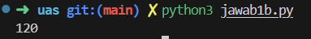
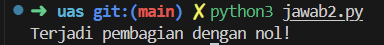
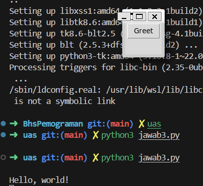
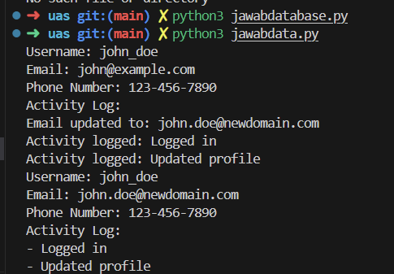

# Uas 20230801315-RafkiAmirulA

1. Fungsi (Function)
Fungsi adalah blok kode yang dirancang untuk melakukan tugas tertentu. Fungsi memudahkan pengelolaan kode dengan membagi tugas besar menjadi tugas-tugas kecil yang dapat digunakan kembali. Fungsi didefinisikan menggunakan kata kunci def diikuti dengan nama fungsi dan tanda kurung ().

**jawaban**
(jawab1.py)

**Capture Hasil**

Rekursi (Recursion)
Rekursi adalah teknik dalam pemrograman di mana suatu fungsi memanggil dirinya sendiri untuk menyelesaikan tugas. Rekursi sering digunakan untuk menyelesaikan masalah yang dapat dipecah menjadi sub-masalah yang lebih kecil, yang mirip dengan masalah asli.
**jawaban**
(jawab1b.py)
**Capture Hasil**

2.  Function of exception handling adalah teknik dalam pemrograman untuk menangani kesalahan atau kondisi luar biasa yang mungkin terjadi selama eksekusi program. Dalam Python, ini dilakukan menggunakan blok try, except, else, dan finally
**jawaban**
(jawab2.py)
**Capture Hasil**

3. GUI (Graphical User Interface) adalah antarmuka pengguna yang memungkinkan pengguna berinteraksi dengan perangkat lunak melalui elemen grafis seperti tombol, ikon, menu, dan jendela. GUI menggantikan antarmuka berbasis teks dengan elemen visual yang lebih intuitif dan mudah digunakan.

Komponen Utama GUI
- Windows: Jendela yang menampilkan informasi atau memungkinkan pengguna memasukkan data.
- Icons: Simbol grafis yang mewakili aplikasi, file, atau fungsi.
- Menus: Daftar opsi atau perintah yang dapat dipilih pengguna.
- Buttons: Elemen yang dapat diklik untuk melakukan tindakan tertentu.
- Text Boxes: Area di mana pengguna dapat memasukkan teks.
- Labels: Teks atau gambar yang memberikan informasi kepada pengguna.

**jawaban**
(jawab3.py)
**Capture Hasil**

4.
pertama jalankan terlebih dahulu database.py
jika sudah muncul user_data.db, maka bisa lanjut ke jalankan data.py untuk melihat hasilnya
**jawaban**
(jawabdatabase.py)
(jawabdata.py)
**Capture Hasil**

