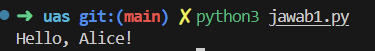
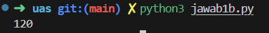

1. Fungsi (Function)
Fungsi adalah blok kode yang dirancang untuk melakukan tugas tertentu. Fungsi memudahkan pengelolaan kode dengan membagi tugas besar menjadi tugas-tugas kecil yang dapat digunakan kembali. Fungsi didefinisikan menggunakan kata kunci def diikuti dengan nama fungsi dan tanda kurung ().

**jawaban**
(jawab1.py)

**Capture Hasil**

2. Rekursi (Recursion)
Rekursi adalah teknik dalam pemrograman di mana suatu fungsi memanggil dirinya sendiri untuk menyelesaikan tugas. Rekursi sering digunakan untuk menyelesaikan masalah yang dapat dipecah menjadi sub-masalah yang lebih kecil, yang mirip dengan masalah asli.
**jawaban**
(jawab1b.py)
**Capture Hasil**

