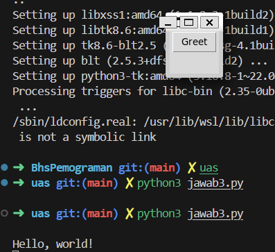

3. GUI (Graphical User Interface) adalah antarmuka pengguna yang memungkinkan pengguna berinteraksi dengan perangkat lunak melalui elemen grafis seperti tombol, ikon, menu, dan jendela. GUI menggantikan antarmuka berbasis teks dengan elemen visual yang lebih intuitif dan mudah digunakan.

Komponen Utama GUI
- Windows: Jendela yang menampilkan informasi atau memungkinkan pengguna memasukkan data.
- Icons: Simbol grafis yang mewakili aplikasi, file, atau fungsi.
- Menus: Daftar opsi atau perintah yang dapat dipilih pengguna.
- Buttons: Elemen yang dapat diklik untuk melakukan tindakan tertentu.
- Text Boxes: Area di mana pengguna dapat memasukkan teks.
- Labels: Teks atau gambar yang memberikan informasi kepada pengguna.

**jawaban**
(jawab3.py)
**Capture Hasil**
