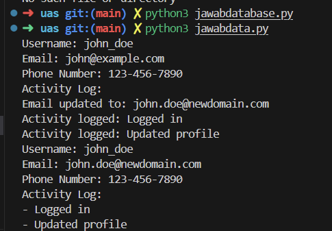

4. Aplikasi Python dapat berkomunikasi dengan database menggunakan berbagai pustaka dan modul yang tersedia. Beberapa pustaka yang umum digunakan adalah sqlite3, SQLAlchemy, PyMySQL, psycopg2, dan lain-lain.

- pertama jalankan terlebih dahulu database.py
- jika sudah muncul user_data.db, maka bisa lanjut ke jalankan data.py untuk melihat hasilnya
**jawaban**
(jawabdatabase.py)
(jawabdata.py)
**Capture Hasil**

